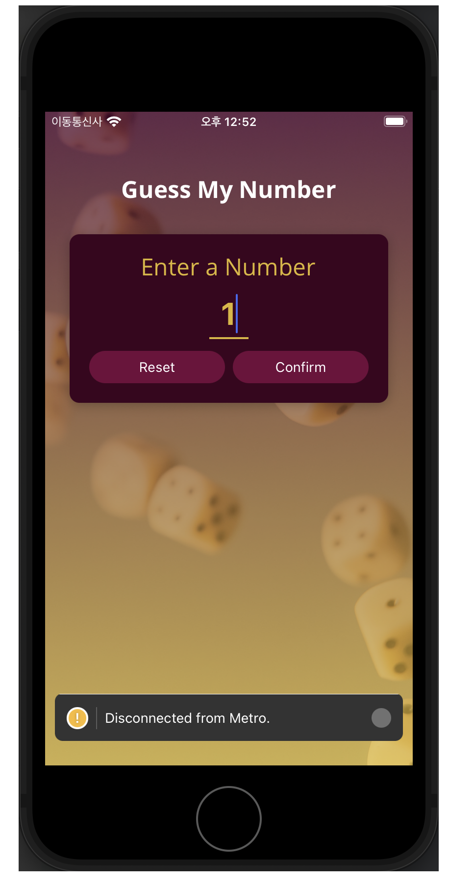

# react-native-minigame
react native 학습용으로 구현한 숫자 up/down 게임

## Getting Started
1. xcode, android studio emulrator 실행
2. npm install
```bash
npm install
# or
yarn install
```
3. android, Ios 앱 실행
```bash
npm start
# or
yarn start
```
위 명령어 실행 후 터미널 창에서 I(IOS), A(Android) 입력

## Preview
### Android
<div style="display:flex;">
  
  
  
</div>

### Ios
<div style="display:flex;">
  
  
  
  
</div>
